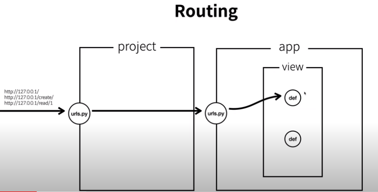

# Organization

## app

- `project` 폴더 내부에 직접 동작을 구현하는게 아니라 `app`이라 하는 더 작은 개념에서 동작을 구현한다.
- 또한 연관된 로직들을 모아서 여러 `app`을 만들 수 있다.
- `app` 안에는 `view`를 만들고 구체적인 로직을 `view`에서 구현한다.

- 흐름을 살펴보면 다음과 같다.


1. 사용자가 접속한다.
2. `project` 안에 있는 `urls.py` 에서 각각의 경로를 어떤 `app` 에게 위임할지 결정 후 위임한다.
3. `app` 안에 있는 `urls.py` 에서 각각의 경로를 어떤 `view` 에 위임할지 결정 후 위임한다.
4. `view` 의 `def(함수)` 는 `model` 을 통해 `DB` 에 자료를 가져온다.
5. 그리고 데이터를 사용하여 사용한 결과를 `html, json, xml` 과 같은 형태로 사용자에게 전달한다.


## Routing



- 접속한 경로를 어떤 `app` 에게 위임할지 결정하는 것을 `Routing` 이라고 한다.
- `project` 와  `app` 안에 있는 `urls.py` 이 현재 위치에서 `Routing` 을 담당한다.


### path

- `path` 는 `url` 과 `view` 를 연결해주는 역할을 한다.

```python
# project/urls.py
from django.contrib import admin
from django.urls import path, include

urlpatterns = [
    path('admin/', admin.site.urls),
    path('', include('app.urls')),  # url에 경로가 없는 주소는 app/urls.py 로 연결
]
```

```python
# app/views.py
from django.shortcuts import HttpResponse


# Create your views here.
def index(request):
    return HttpResponse("Welcome to Django!")


def create(request):
    return HttpResponse("Create a new record.")


def read(request, id):
    return HttpResponse("Read a record " + id)

```

```python
# app/urls.py
from django.urls import path
from app import views

urlpatterns = [
    path('', views.index),  # url에 경로가 없는 주소는 views.py 의 index 함수로 연결
    path('create/', view.create)  # url 경로가 create/ 인 주소는 views.py 의 create 함수로 연결
    path('read/<id>/', view.read)  # <> 는 변수로 사용하며, views.py 의 read 함수로 연결
]
```

- `project` 에서 첫 경로를 보고 경로와 연결된 `app` 으로 위임한 후, `app` 은 그 이후의 경로를 보고 `view` 로 위임한다. 


## Web Server vs Web Application Server

- Web Server: apache, nginx, IIS, ...
- Web Application Server: django, flask, php, jsp, ROL, ...

|          | Web Server                                        | Web Application Server                                               |
|----------|---------------------------------------------------|----------------------------------------------------------------------|
| web page | - 사용할 페이지를 미리 만들어 놓아야 함<br/>- 1.html, 2.html, ... | - 웹 페이지를 생성하는 프로그램 하나를 만들면 됨<br/>- view.py                           |
| 접속 동작    | - 만들어진 페이지를 제공<br/>- static 하다                    | - 접속 요청한 페이지를 만들어서 제공<br/>- dynamic 하다                               |
| 특징       | - 굉장히 빠르다<br/>- 배울 것이 많지 않다.                      | - 웹서버에 비해 느리다.<br/>- 언어, frame work, DB 등 배울 것이 많다.<br/>- 유지보수가 편하다. |
